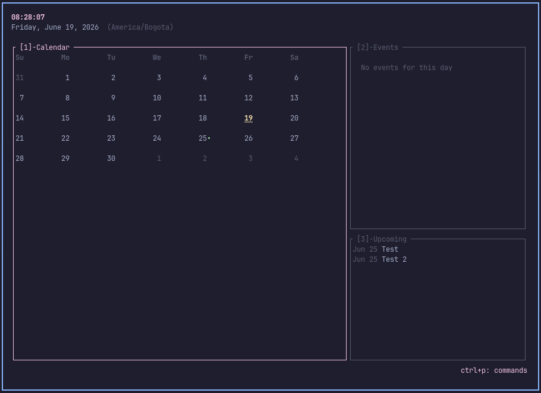

# Solstice

A local-first TUI calendar for the terminal. All events are stored in a local SQLite database. Google Calendar sync is optional and read-only.



## Install

Requires [Rust](https://rustup.rs).

```bash
./install.sh
```

The script builds the binary, installs it to `~/.cargo/bin/solstice`, and creates a config file at `~/.config/solstice/config.toml`. If a config already exists, it asks what to do before touching anything.

## Usage

```bash
solstice          # launch the TUI
solstice sync     # pull events from Google Calendar (one-shot, no daemon)
```

## Key bindings

| Key | Action |
|-----|--------|
| `q` | Quit |
| `v` | Toggle monthly / weekly view |
| `t` | Jump to today |
| `n` | New event |
| `e` | Edit selected event |
| `d` | Delete selected event |
| `c` | Settings (country code, API key) |
| `H` | Force-refresh holidays |
| `Enter` | Event detail overlay |
| `Tab` | Cycle panel focus (Calendar → Events → Upcoming) |
| `1` / `2` / `3` | Jump to panel directly |
| `Ctrl+P` | Command palette |
| `h l j k` / arrows | Navigate |

## Configuration

Config lives at `~/.config/solstice/config.toml` and is created automatically on first run.

```toml
# IANA timezone name
timezone = "America/New_York"

# ISO 3166-1 alpha-2 country code for bundled holiday data
country_code = "US"

# Display formats (chrono specifiers)
date_format = "%A, %B %d, %Y"
time_format = "%H:%M:%S"

# First day of the week: "sunday" or "monday"
first_day_of_week = "sunday"

# Number of upcoming events shown in the sidebar
upcoming_event_count = 5

# Optional: Calendarific API key for online holiday data
# Without this, Solstice uses bundled offline data.
# calendarific_api_key = "your_key_here"

# Optional: Google Calendar OAuth2 credentials
# gcal_client_id     = "your_client_id.apps.googleusercontent.com"
# gcal_client_secret = "your_client_secret"
```

## Google Calendar sync

Solstice uses the [OAuth2 Device Authorization Grant](https://www.rfc-editor.org/rfc/rfc8628) — no browser redirect, no local server. You authorize once from a URL printed in the terminal, and the token is stored at `~/.config/solstice/gcal_token.json`.

Synced events are **read-only**. Edit and delete are blocked on Google Calendar events inside the TUI.

**Setup:**

1. Create a project in [Google Cloud Console](https://console.cloud.google.com) and enable the Calendar API.
2. Create OAuth 2.0 credentials (Desktop app type) and copy the client ID and secret.
3. Add them to `~/.config/solstice/config.toml`.
4. Run `solstice sync` — follow the printed URL to authorize.

## Holiday data

Solstice ships bundled holiday JSON files for most countries (`assets/holidays/`). If you set a `calendarific_api_key` in your config, the app switches to live Calendarific data with a 24-hour local cache.

## Development

```bash
cargo build          # debug build
cargo test           # unit tests
cargo clippy         # lints

# Integration tests (require network mock — no real API calls)
cargo test --features test-utils --test gcal_integration -- --ignored
```

Data is stored in `~/.local/share/solstice/events.db`. Tests use an in-memory SQLite database and never touch the on-disk file.
